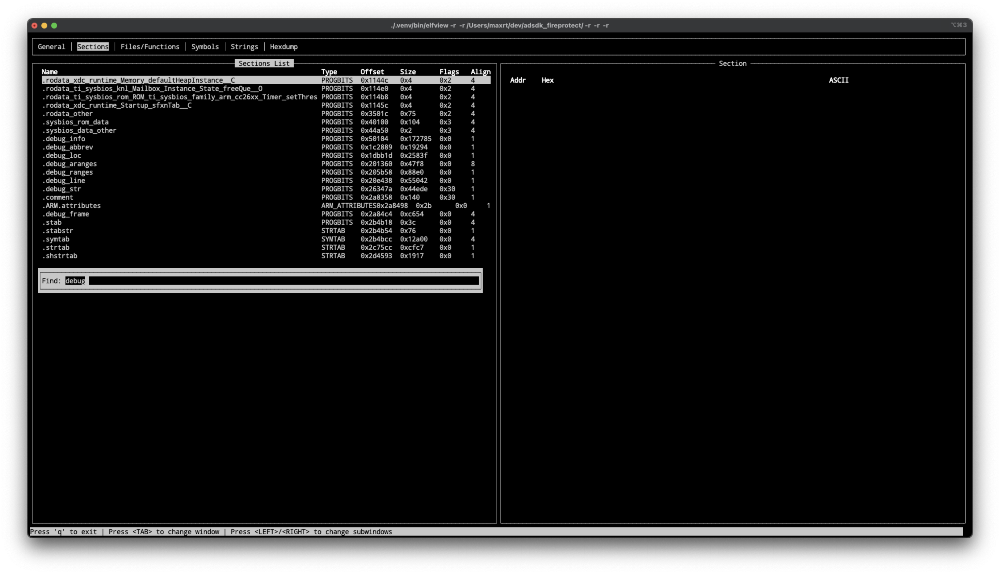

```
 /$$$$$$$$ /$$       /$$$$$$$$ /$$    /$$ /$$                        
| $$_____/| $$      | $$_____/| $$   | $$|__/                        
| $$      | $$      | $$      | $$   | $$ /$$  /$$$$$$  /$$  /$$  /$$
| $$$$$   | $$      | $$$$$   |  $$ / $$/| $$ /$$__  $$| $$ | $$ | $$
| $$__/   | $$      | $$__/    \  $$ $$/ | $$| $$$$$$$$| $$ | $$ | $$
| $$      | $$      | $$        \  $$$/  | $$| $$_____/| $$ | $$ | $$
| $$$$$$$$| $$$$$$$$| $$         \  $/   | $$|  $$$$$$$|  $$$$$/$$$$/
|________/|________/|__/          \_/    |__/ \_______/ \_____/\___/    
```

## ELFView

Script to inspect ELF files.  
Uses pyelftools or lief (can be configured) to extract various information from ELF file.  
Currently extracts:  
 - Name  
 - Size  
 - Created/Modified/Accessed dates  
 - ELF File type  
 - Target Machine  
 - ABI  
 - Flags  
 - Entrypoint  
 - Sections (type, offset, size, flags, alignment)  
 - Hexdump of each sections' contents  
 - All source files that were used in compilation and their (compiled) sizes [1]  
 - All functions (code size, name, return type, argument names and types) [1]  
 - All variables (code size, name, type) [1]  
 - Cumulative size of functions and variable for whole ELF file [2] and for CU (source file) [1]  
 - All symbols (from `.symtab` section)  
 - All strings (either from string sections, or from whole file (scanned))  
 - Hexdump of whole ELF file  

[1] - Needs Dwarf sections present (can be enabled using debug a build).  
[2] - Use `f` key in Files window to filter files by part of name or folder.  

### Usage
Run elfview with desired ELF file: `python3 elfview.py Test.elf`.  


### Keybinds
Use `q` to exit.
Use `Tab` to switch between windows (topmost bar indicates which windows are available and which is currently selected)  
Use `LEFT ARROW`/`RIGHT ARROW` to switch between sub windows (pads).  
Use `UP ARRAY`/`DOWN ARROW` to scroll in lists.  
Use `/` to trigger search dialogue where it is applicable.  
Use `f` in `Files` pad of `Files/Functions` window to trigger filter dialogue.  
Use `[`/`]` to skip `config.PAGE_SCROLL_SKIP_SIZE` lines at once.  
Use `ESC` to close dialogues (search/filter and such).  
Use `n`/`p` to select next/prev occurrence of searched text.  

### Search/Filter
Press `f`, enter phrase to search for and press `Enter`.  



It should work in any window with scrollable content.  

Upon successful search cursor will be moved to first occurrence of searched string.  
All occurrences will be highlighted.  


If search didn't find anything, you will see an alert.  
It can be closed by pressing any key.  


Filter works the same way, but without alerts, if nothing's found and is usable only in `Files/Functions` window.  

### Installation
Clone the repo: `git@github.com:maxrt101/elfview.git`.  
Install pyelftools (recommended) or LIEF extended.  
Create virtual environment and activate it (or not): `python3 -m venv .venv && . .venv/bin/activate`.  
Install elfview: `pip3 install .` (use `pip3 install -e .` for development).  
Run the script, either directly `python3 elfview.py <ELF>` or through script install in env `bin` (e.g. if using venv: `./.venv/vin/elfview <ELF>`).  

### Command Line Arguments
```commandline
usage: ELFView [-h] [-b BACKEND] [-r REMOVE_FILE_PREFIXES] [-c CONFIG_OVERRIDES] FILE

TUI Application to look into ELF files

positional arguments:
  FILE                                            ELF file to parse

options:
  -h, --help                                      show this help message and exit
  -b BACKEND, --backend BACKEND                   What library to use as backend (elftools or lief)
  -r REMOVE_FILE_PREFIXES, --remove-file-prefix REMOVE_FILE_PREFIXES
                                                  Removes specified file prefix from Files window (to see the actual file name)
  -c CONFIG_OVERRIDES, --config CONFIG_OVERRIDES  Override config variables at runtime. Example -c DEBUG=True
```

`FILE` - Path to ELF File.  
`-h, --help` - Prints above message.  
`-b, --backend` - Specifies backend library to use (`elftools` or `lief`).  
`-r, --remove-file-prefix` - Prefix for `Files` tab in `Files/Functions` window to be removed from CU path.  
`-c, --config` - Override config value.  


### Config
A lot of things can be configured through value present in `elfvview/config.py` file.  
You can configure your own installation (e.g. remap keys, change colors) by editing this file and reinstalling the package.  
Another possibility to reconfigure functionality on-the-fly is to use `-c, --config` (e.g. `-c DEBUG=True`).  

Here is a brief description of all configurable options:  
`BACKEND` - Select default backend (`elftools`/`lief`).  
`USE_COLORFUL_HEXDUMP` - Use color accents on every hexdump generated.  
`DEFER_HEXDUMP_GENERATION` - Don't generate whole hexdump upon file parsing.  
`RESET_FINDER_ON_LINKED_PAD_CHANGE` - Reset search when parent tab changed position (e.g. when selected file is changed, reset search in function pad).  
`SEARCH_WHOLE_BUFFER` - Affects all search. If on - will not search all buffer, only area around cursor, specified by `SEARCH_REACH`.  
`SEARCH_REACH` - Offsets (positive and negative) for cursor then `SEARCH_WHOLE_BUFFER` if off.  
`SEARCH_USE_NEXT_OCCURRENCE` - Turns on/off functionality of `n`/`p`. By default, mirrors `SEARCH_WHOLE_BUFFER` because selecting occurrences on partial search is unstable.  
`DEBUG` - Turns on some debug features (e.g. will print window and pad number in left corner, and print startup logs one line at a time, waiting for a keypress).  
`USE_STRINGS_FROM_SECTIONS` - Don't parse whole ELF for strings, use ones available in `.symtab` and such.  
`DEFAULT_STRING_MIN_LENGTH` - If `USE_STRINGS_FROM_SECTIONS` is `False`, will use this length as a minimal criteria for considering a null-terminated sequence of characters a string.  
`PAGE_SCROLL_SKIP_SIZE` - How many lines should `[`/`]` skip.  
`WINDOW_SWITCH_BAR_SIZE` - Height of window switch bar (topmost bar with currently selected window amongst list of all windows)  
`FILES_WINDOW_INFO_PAD_SIZE` - Height of `Info` pad under `Files/Variables` window.  
`HEXDUMP_WIDTH_TO_BYTE_SIZE_COEFFICIENT` - Magic number that is used to calculate number of bytes in line for hexdump considering screen width.  

`KeyMap` - Key mapping, name should suggest what the binding is responsible for, value shows default value. Uses int value of ascii char as value.  
`ColorMap` - Color mapping. First value in tuple is foreground color, second - background.  

There is currently no way to redefine keys or colors from command line, so reinstallation is required.  
